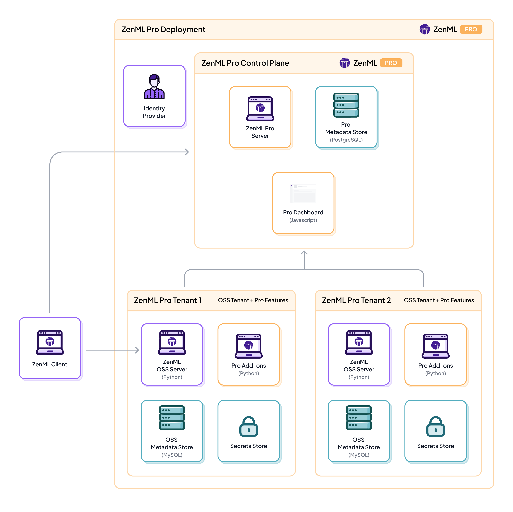
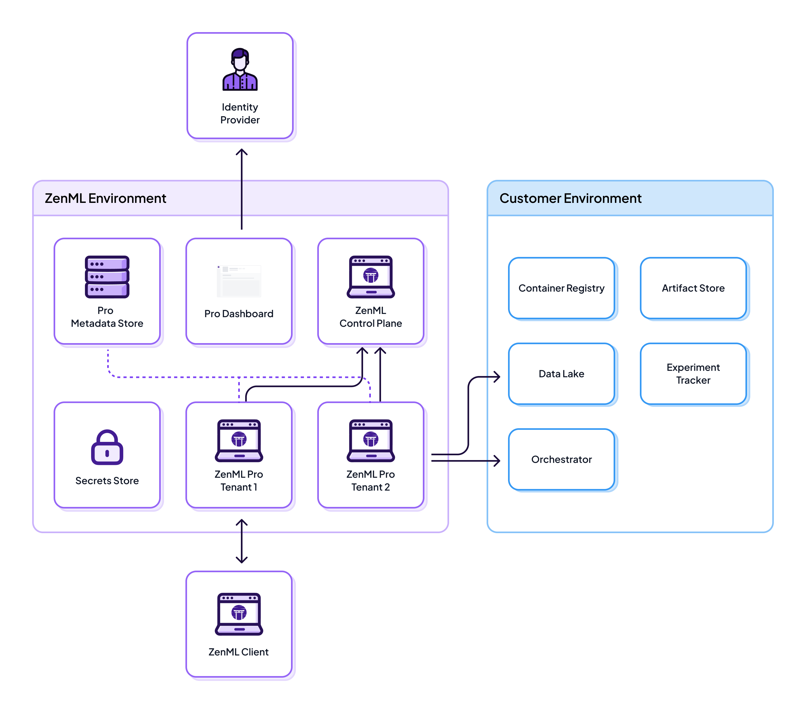
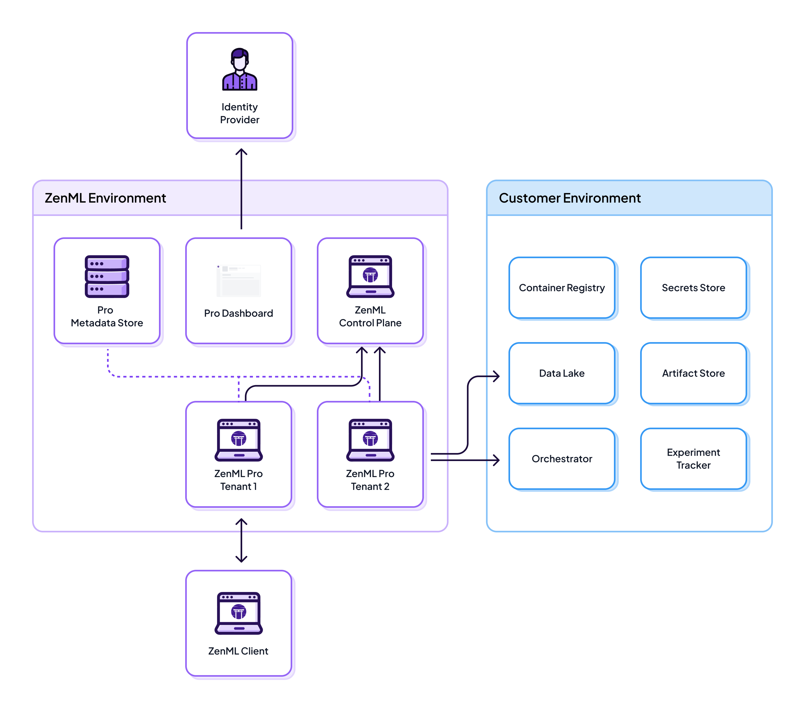
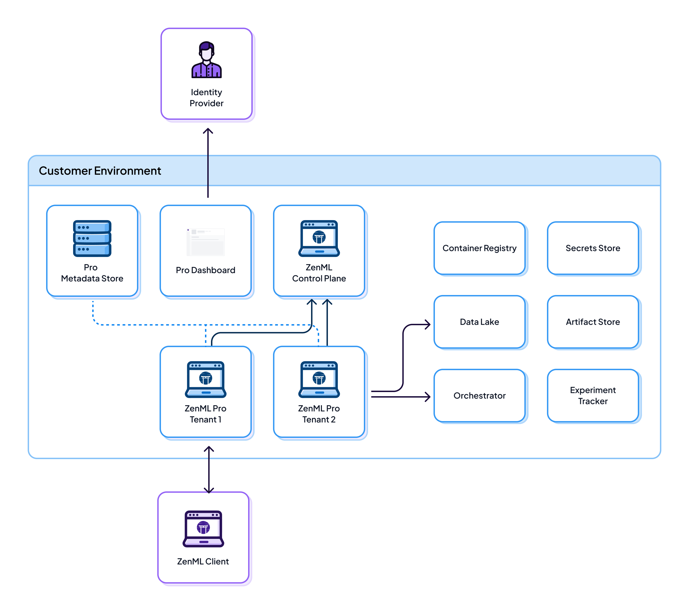

# 🏛️ System Architecture

This guide walks through the various ways that ZenML can be deployed, from self-hosted OSS, to
SaaS, to self-hosted ZenML Pro!

## ZenML OSS (Self-hosted)


This page is intended as a high level overview. To learn more about how about to deploy ZenML OSS,
read [this guide](../getting-started/deploying-zenml/README.md).


A ZenML OSS deployment consists of the following moving pieces:

* **ZenML OSS Server**: This is a FastAPI app that manages metadata of pipelines, artifacts, stacks etc.
  Note: In ZenML Pro, the notion of a ZenML server is replaced with what is known as a "Tenant". For
  all intents and purposes, consider a ZenML Tenant to be a ZenML OSS server that comes with more functionality. 
* **OSS Metadata Store**: This is where all ZenML tenant metadata is stored, including
  ML metadata such as tracking and versioning information about pipelines and
  models.
* **OSS Dashboard**: This is a ReactJS app that shows pipelines, runs, etc.
* **Secrets Store**: All secrets and credentials required to access customer
  infrastructure services are stored in a secure secrets store. The ZenML Pro
  API has access to these secrets and uses them to access customer
  infrastructure services on behalf of the ZenML Pro. The secrets store can be
  hosted either by the ZenML Pro or by the customer.

ZenML OSS is free with Apache 2.0 license. Learn how to deploy it [here](./deploying-zenml/README.md).


To learn more about the core concepts for ZenML OSS, go [here](../getting-started/core-concepts.md).


## ZenML Pro (SaaS or Self-hosted)


If you're interested in assessing ZenML Pro SaaS, you can create
a [free account](https://cloud.zenml.io/?utm\_source=docs\&utm\_medium=referral\_link\&utm\_campaign=cloud\_promotion\&utm\_content=signup\_link).

If would like to self-host ZenML Pro, please [book a demo](https://zenml.io/book-a-demo).


The above deployment can be augmented with the ZenML Pro components:

* **ZenML Pro Control Plane**: This is the central controlling entity of all tenants.
* **Pro Dashboard**: This is a dashboard that builds on top of the OSS dashboard, and
add further functionality.
* **Pro Metadata Store**: This is a PostgreSQL database where all ZenML Pro related metadata is stored such
as roles, permissions, teams, and tenant management related data.
* **Pro Add-ons**: These are Python modules injected into the OSS Server for enhanced functionality.
* **Identity Provider**: ZenML Pro offers flexible authentication options.
  In cloud-hosted deployments, it integrates with [Auth0](https://auth0.com/),
  allowing users to log in via social media or corporate credentials.
  For self-hosted deployments, customers can configure their
  own identity management solution, with ZenML Pro supporting
  custom OIDC provider integration. This allows organizations to
  leverage their existing identity infrastructure for authentication
  and authorization, whether using the cloud service or deploying on-premises.

ZenML Pro offers many additional features to increase your teams
productivity. No matter your specific needs, the hosting options for ZenML Pro
range from easy SaaS integration to completely air-gapped deployments on your own
infrastructure.

You might have noticed this architecture builds on top of the ZenML OSS system architecture.
Therefore, if you already have ZenML OSS deployed, it is easy to enroll it as part of a
ZenML Pro deployment!

The above components interact with other MLOps stack components, secrets, and data in
the following scenarios described below.


To learn more about the core concepts for ZenML Pro, go [here](../getting-started/zenml-pro/core-concepts.md)


### ZenML Pro SaaS Architecture

For the ZenML Pro SaaS deployment case, all ZenML services are hosted on infrastructure hosted by the ZenML Team.
Customer secrets and credentials required to access customer infrastructure are
stored and managed by the ZenML Pro Control Plane.

On the ZenML Pro infrastructure, only ML _metadata_ (e.g. pipeline and
model tracking and versioning information) is stored. All the actual ML data
artifacts (e.g. data produced or consumed by pipeline steps, logs and
visualizations, models) are stored on the customer cloud. This can be set up
quite easily by configuring
an [artifact store](../component-guide/artifact-stores/artifact-stores.md)
with your MLOps stack.

Your tenant only needs permissions to read from this data to display artifacts
on the ZenML dashboard. The tenant also needs direct access to parts of the
customer infrastructure services to support dashboard control plane features
such as CI/CD, triggering and running pipelines, triggering model deployments
and so on.

The advantage of this setup is that it is a fully-managed service, and is
very easy to get started with. However, for some clients even some metadata
can be sensitive; these clients should refer to the other architecture diagram.

Detailed Architecture Diagram for SaaS deployment

<figure><figcaption>ZenML Pro Full SaaS deployment with ZenML secret store</figcaption></figure>

We also offer a hybrid SaaS option where customer secrets are stored on the
customer side. In this case, the customer connects their own
secret store directly to the ZenML server that is managed by us. All ZenML
secrets used by running pipelines to access infrastructure services and
resources are stored in the customer secret store. This allows users to
use [service connectors](../how-to/infrastructure-deployment/auth-management/service-connectors-guide.md)
and the [secrets API](../how-to/interact-with-secrets.md) to authenticate
ZenML pipelines and the ZenML Pro to third-party services and infrastructure
while ensuring that credentials are always stored on the customer side.


Detailed Architecture Diagram for SaaS deployment with custom secret store configuration

<figure><figcaption>ZenML Pro Full SaaS deployment with customer secret store</figcaption></figure>

### ZenML Pro Self-Hosted Architecture

In the case of self-hosting ZenML Pro, all services, data, and secrets are deployed on the customer
cloud. This is meant for customers who
require completely air-gapped deployments, for the tightest security standards.
[Reach out to us](mailto:cloud@zenml.io) if you want to set this up.

Detailed Architecture Diagram for self-hosted ZenML Pro deployment

<figure><figcaption>ZenML Pro self-hosted deployment details</figcaption></figure>

Are you interested in ZenML Pro? [Sign up](https://cloud.zenml.io/?utm\_source=docs\&utm\_medium=referral\_link\&utm\_campaign=cloud\_promotion\&utm\_content=signup\_link)
and get access to Scenario 1. with a free 14-day trial now!

<figure><figcaption></figcaption></figure>
