# Deploy a cloud stack with a single click

In ZenML, the [stack](../../user-guide/production-guide/understand-stacks.md) 
is a fundamental concept that represents the configuration of your 
infrastructure. In a normal workflow, creating a stack
requires you to first deploy the necessary pieces of infrastructure and then 
define them as stack components in ZenML with proper authentication.

Especially in a remote setting, this process can be challenging and 
time-consuming, and it may create multi-faceted problems. This is why we 
implemented a feature, that allows you to **deploy the necessary pieces of 
infrastructure on your selected cloud provider and get you started on remote 
stack with a single click**.


If you prefer to have more control over where and how resources are provisioned
in your cloud, you can [use one of our Terraform modules](deploy-a-cloud-stack-with-terraform.md)
to manage your infrastructure as code yourself.

If you have the required infrastructure pieces already deployed on your cloud, 
you can also use [the stack wizard to seamlessly register your stack](../../how-to/stack-deployment/register-a-cloud-stack.md).


## How to use the 1-click deployment tool?

The first thing that you need in order to use this feature is a
deployed instance of ZenML (not a local server via `zenml up`). If you do 
not already have it set up for you, feel free to learn how to do so
[here](../../getting-started/deploying-zenml/README.md).

Once you are connected to your deployed ZenML instance, you can use the 
1-click deployment tool either through the dashboard or the CLI:




In order to create a remote stack over the dashboard go to the stacks page 
on the dashboard and click "+ New Stack".


Since we will be deploying it from scratch, select "New Infrastructure" on the
next page:


### AWS

If you choose `aws` as your provider, you will see a page where you will have 
to select a region and a name for your new stack:

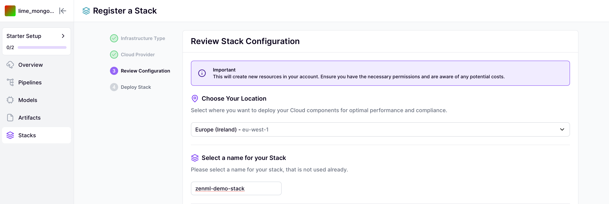

Once the configuration is finished, you will see a deployment page:


Clicking on the "Deploy in AWS" button will redirect you to a Cloud Formation page on AWS Console. 


You will have to log in to your AWS account, review and confirm the 
pre-filled configuration and create the stack.


### GCP

If you choose `gcp` as your provider, you will see a page where you will have 
to select a region and a name for your new stack:

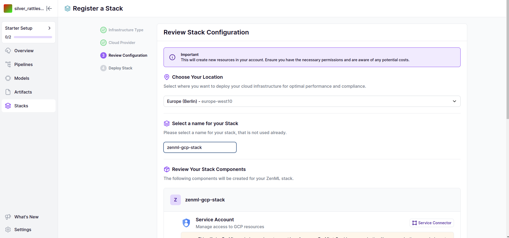
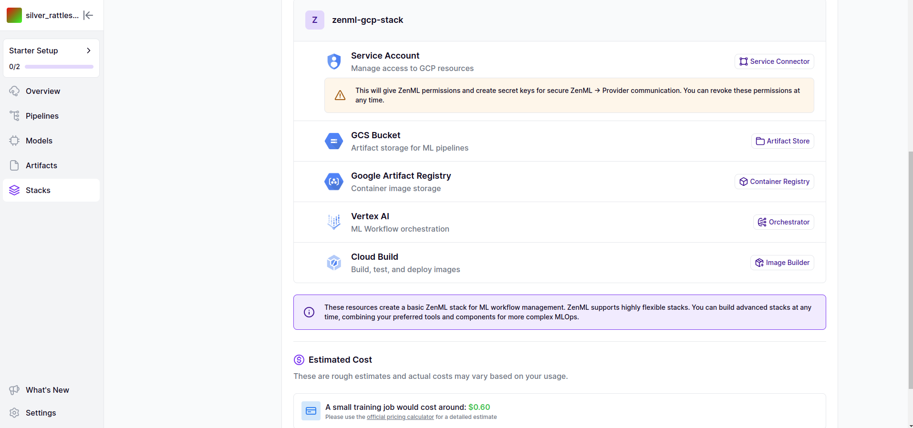

Once the configuration is finished, you will see a deployment page:

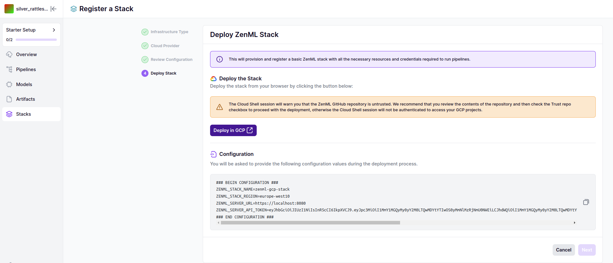

Make note of the configuration values provided to you in the ZenML dashboard. You will need these in the next step.

Clicking on the "Deploy in GCP" button will redirect you to a Cloud Shell session on GCP.



The Cloud Shell session will warn you that the ZenML GitHub repository is
untrusted. We recommend that you review
[the contents of the repository](https://github.com/zenml-io/zenml/tree/main/infra/gcp)
and then check the `Trust repo` checkbox to proceed with the deployment,
otherwise the Cloud Shell session will not be authenticated to access your
GCP projects. You will also get a chance to review the scripts that will be
executed in the Cloud Shell session before proceeding.



After the Cloud Shell session starts, you will be guided through the process of
authenticating with GCP, configuring your deployment, and finally provisioning
the resources for your new GCP stack using Deployment Manager.

First, you will be asked to create or choose an existing GCP project with billing
enabled and to configure your terminal with the selected project:


Next, you will be asked to configure your deployment by pasting the configuration
values that were provided to you earlier in the ZenML dashboard. You may need to switch back to the ZenML dashboard to copy these values if you did not do so earlier:


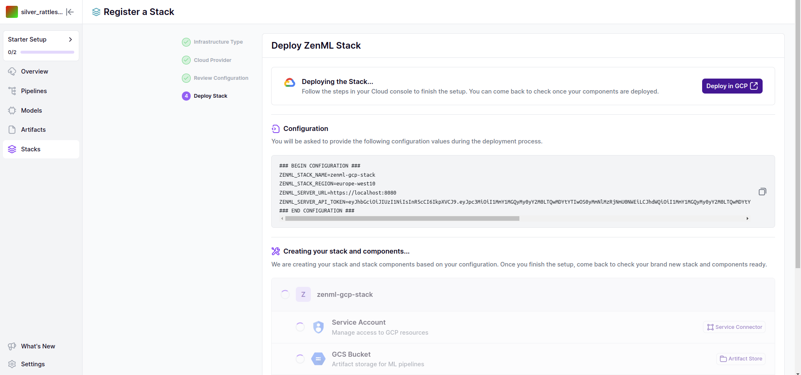

You can take this opportunity to review the script that will be executed at the
next step. You will notice that this script starts by enabling some necessary
GCP service APIs and configuring some basic permissions for the service accounts
involved in the stack deployment, and then deploys the stack using a GCP
Deployment Manager template. You can proceed with the deployment by running the
script in your terminal:


The script will deploy a GCP Deployment Manager template that provisions the
necessary resources for your new GCP stack and automatically registers the stack
with your ZenML server. You can monitor the progress of the deployment in your
GCP console:


Once the deployment is complete, you may close the Cloud Shell session and return
to the ZenML dashboard to view the newly created stack:


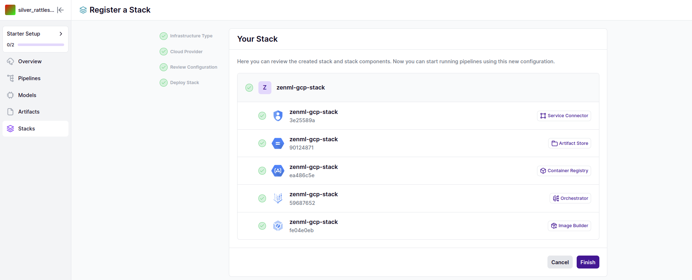

### Azure


Currently, the 1-click deployment for Azure is only supported in the CLI. We are
working on bringing support to the dashboard as well. Stay in touch for further
updates.





In order to create a remote stack over the CLI, you can use the following 
command:

```shell
zenml stack deploy -p {aws|gcp|azure}
```

### AWS

If you choose `aws` as your provider, the command will walk you through
deploying a Cloud Formation stack on AWS. It will start by showing some
information about the stack that will be created:

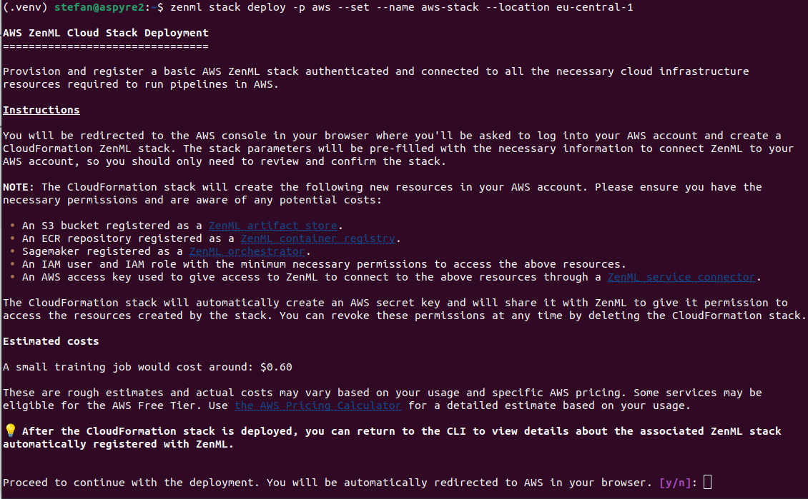

Upon confirmation, the command will redirect you to a Cloud Formation page on
AWS Console where you will have to deploy the stack:


You will have to log in to your AWS account, have permission to deploy an AWS 
Cloud Formation stack, review and confirm the pre-filled configuration and 
create the stack.


The Cloud Formation stack will provision the necessary resources for your new
AWS stack and automatically register the stack with your ZenML server. You can
monitor the progress of the stack in your AWS console:

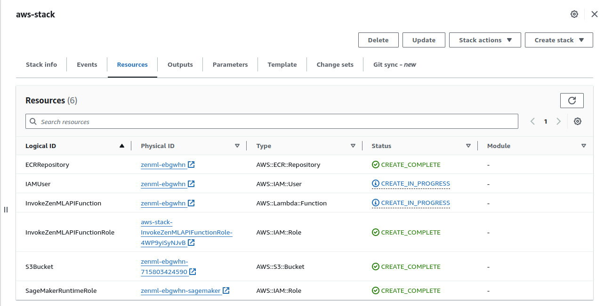

Once the provisioning is complete, you may close the AWS Cloud Formation page
and return to the ZenML CLI to view the newly created stack:

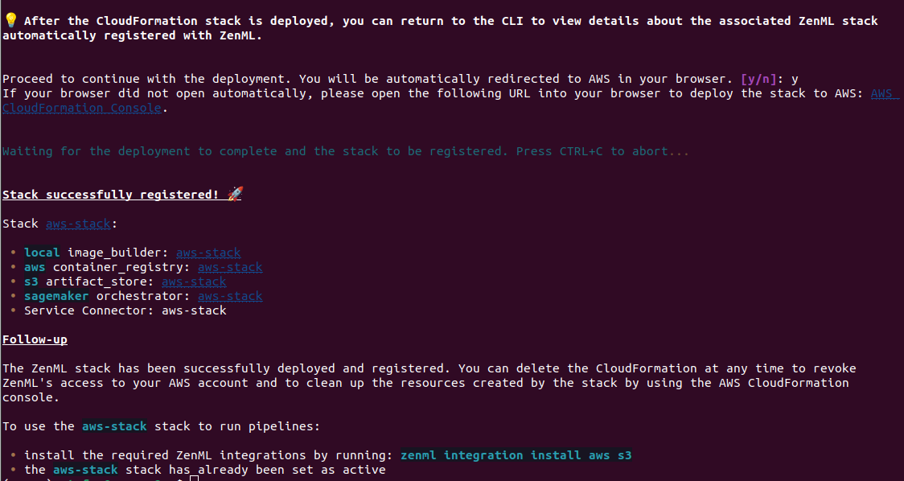


### GCP

If you choose `gcp` as your provider, the command will walk you through
deploying a Deployment Manager template on GCP. It will start by showing some
information about the stack that will be created:


Upon confirmation, the command will redirect you to a Cloud Shell session on GCP.



The Cloud Shell session will warn you that the ZenML GitHub repository is
untrusted. We recommend that you review
[the contents of the repository](https://github.com/zenml-io/zenml/tree/main/infra/gcp)
and then check the `Trust repo` checkbox to proceed with the deployment,
otherwise the Cloud Shell session will not be authenticated to access your
GCP projects. You will also get a chance to review the scripts that will be
executed in the Cloud Shell session before proceeding.



After the Cloud Shell session starts, you will be guided through the process of
authenticating with GCP, configuring your deployment, and finally provisioning
the resources for your new GCP stack using Deployment Manager.

First, you will be asked to create or choose an existing GCP project with billing
enabled and to configure your terminal with the selected project:


Next, you will be asked to configure your deployment by pasting the configuration
values that were provided to you in the ZenML CLI. You may need to switch back
to the ZenML CLI to copy these values if you did not do so earlier:


You can take this opportunity to review the script that will be executed at the
next step. You will notice that this script starts by enabling some necessary
GCP service APIs and configuring some basic permissions for the service accounts
involved in the stack deployment and then deploys the stack using a GCP
Deployment Manager template. You can proceed with the deployment by running the
script in your terminal:


The script will deploy a GCP Deployment Manager template that provisions the
necessary resources for your new GCP stack and automatically registers the stack
with your ZenML server. You can monitor the progress of the deployment in your
GCP console:


Once the deployment is complete, you may close the Cloud Shell session and return
to the ZenML CLI to view the newly created stack:


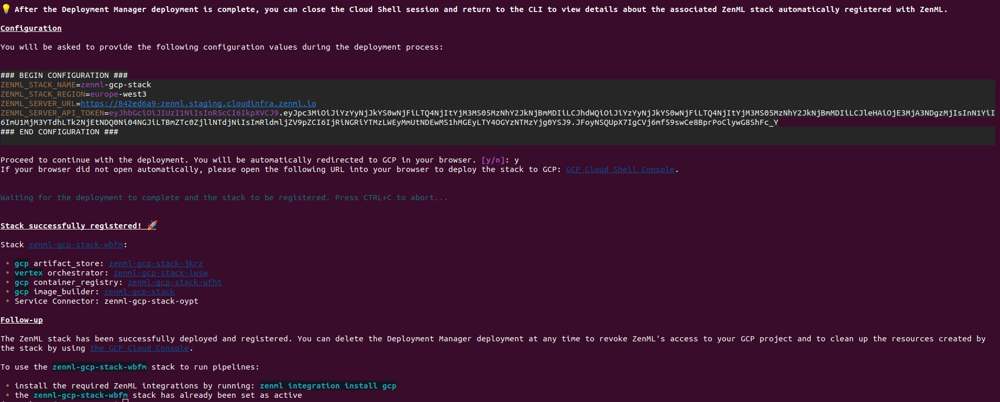

### Azure

If you choose `azure` as your provider, the command will walk you through
deploying [the ZenML Azure Stack Terraform module](https://registry.terraform.io/modules/zenml-io/zenml-stack/azure).
It will start by showing some information about the stack that will be created:

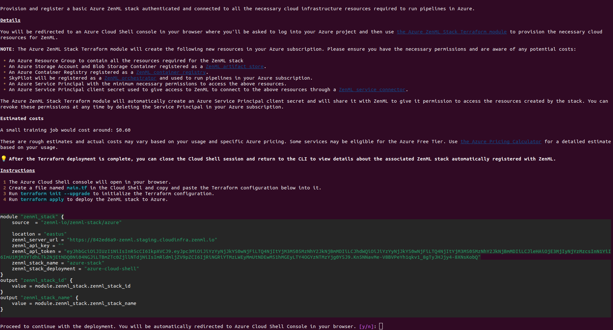

Upon confirmation, the command will redirect you to a Cloud Shell session on Azure.

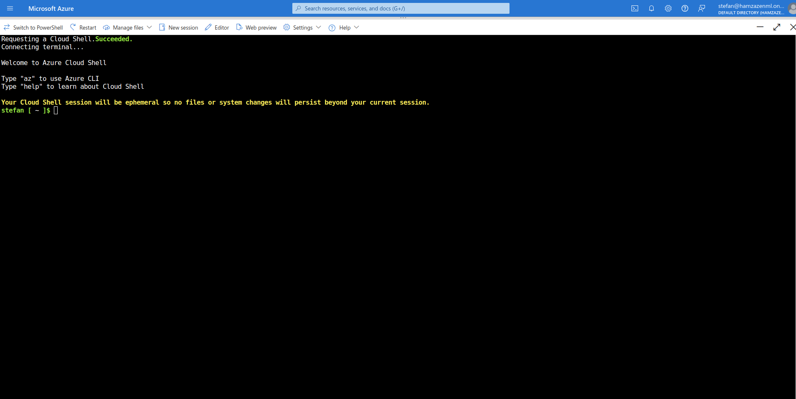

After the Cloud Shell session starts, you will have to use Terraform to deploy
the stack, as instructed by the CLI.

First, you will have to open a file named `main.tf` in the Cloud Shell session
using the editor of your choice (e.g. `vim`, `nano`) and paste in the Terraform
configuration provided by the CLI. You may need to switch back to the ZenML CLI
to copy these values if you did not do so earlier:

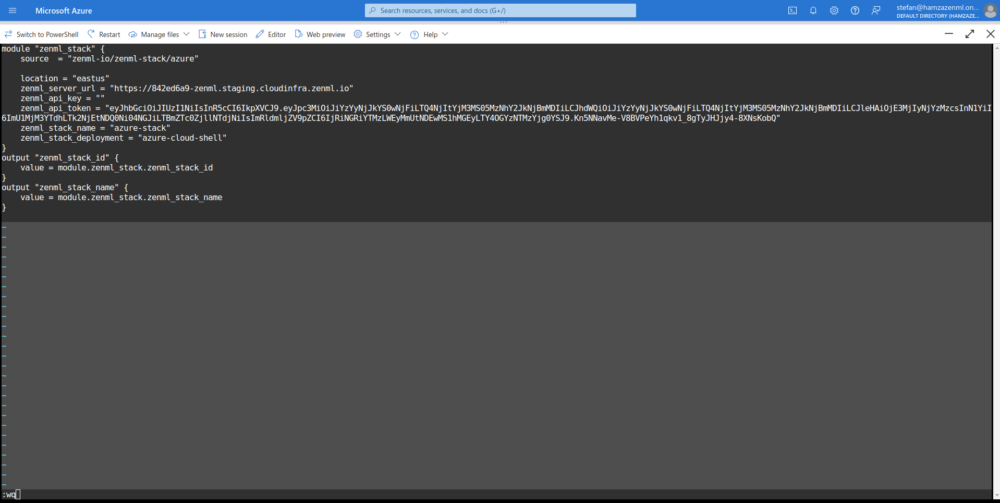

The Terraform file is a simple configuration that uses [the ZenML Azure Stack Terraform module](https://registry.terraform.io/modules/zenml-io/zenml-stack/azure)
to deploy the necessary resources for your Azure stack and then automatically
register the stack with your ZenML server. You can read more about the module
and its configuration options in the module's documentation.

You can proceed with the deployment by running the `terraform init` and
`terraform apply` Terraform commands in your terminal:

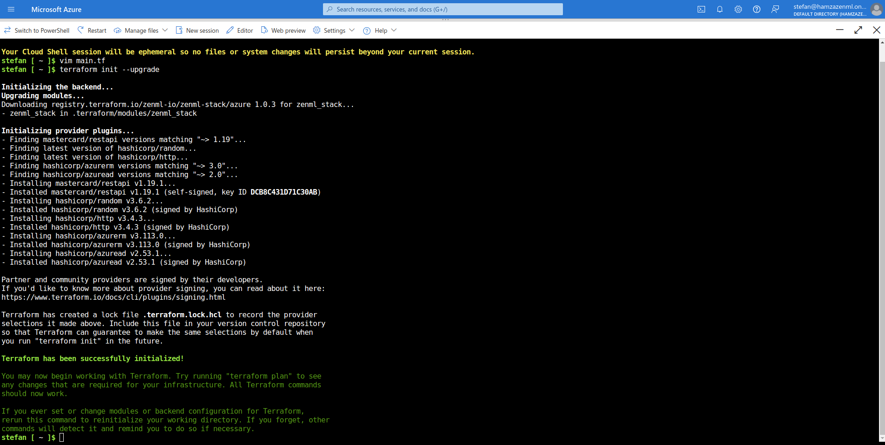
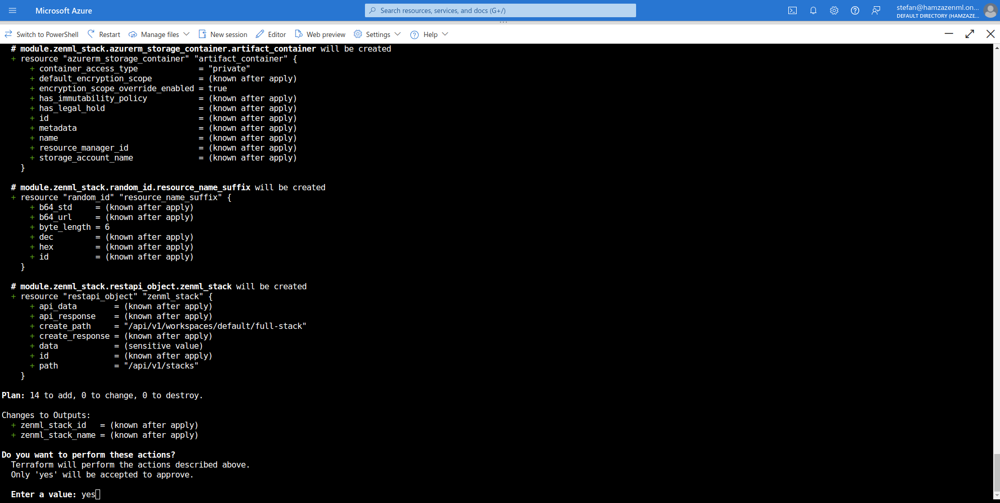

Once the Terraform deployment is complete, you may close the Cloud Shell
session and return to the ZenML CLI to view the newly created stack:

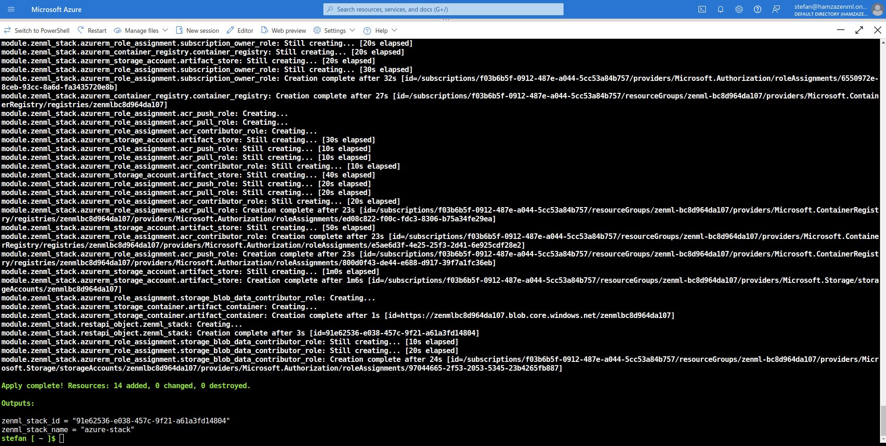





## What will be deployed?

Here is an overview of the infrastructure that the 1-click deployment will
prepare for you based on your cloud provider:




### Resources

- An S3 bucket that will be used as a ZenML Artifact Store.
- An ECR container registry that will be used as a ZenML Container Registry.
- Permissions to use SageMaker as a ZenML Orchestrator.
- An IAM user and IAM role with the minimum necessary permissions to access 
the resources listed above.
- An AWS access key used to give access to ZenML to connect to the above 
resources through a ZenML service connector.

### Permissions

The configured IAM service account and AWS access key will grant ZenML the
following AWS permissions in your AWS account:

* S3 Bucket:
  * s3:ListBucket
  * s3:GetObject
  * s3:PutObject
  * s3:DeleteObject
  * s3:GetBucketVersioning
  * s3:ListBucketVersions
  * s3:DeleteObjectVersion
* ECR Repository:
  * ecr:DescribeRepositories
  * ecr:ListRepositories
  * ecr:DescribeRegistry
  * ecr:BatchGetImage
  * ecr:DescribeImages
  * ecr:BatchCheckLayerAvailability
  * ecr:GetDownloadUrlForLayer
  * ecr:InitiateLayerUpload
  * ecr:UploadLayerPart
  * ecr:CompleteLayerUpload
  * ecr:PutImage
  * ecr:GetAuthorizationToken
* SageMaker (Client):
  * sagemaker:CreatePipeline
  * sagemaker:StartPipelineExecution
  * sagemaker:DescribePipeline
  * sagemaker:DescribePipelineExecution
* SageMaker (Jobs):
  * AmazonSageMakerFullAccess




### Resources

- A GCS bucket that will be used as a ZenML Artifact Store.
- A GCP Artifact Registry that will be used as a ZenML Container Registry.
- Permissions to use Vertex AI as a ZenML Orchestrator.
- Permissions to use GCP Cloud Builder as a ZenML Image Builder.
- A GCP Service Account with the minimum necessary permissions to access 
the resources listed above.
- An GCP Service Account access key used to give access to ZenML to connect to
the above  resources through a ZenML service connector.

### Permissions

The configured GCP service account and its access key will grant ZenML the
following GCP permissions in your GCP project:

* GCS Bucket:
  * roles/storage.objectUser
* GCP Artifact Registry:
  * roles/artifactregistry.createOnPushWriter
* Vertex AI (Client):
  * roles/aiplatform.user
* Vertex AI (Jobs):
  * roles/aiplatform.serviceAgent
* Cloud Build (Client):
  * roles/cloudbuild.builds.editor




### Resources

- An Azure Resource Group to contain all the resources required for the ZenML stack
- An Azure Storage Account and Blob Storage Container that will be used as a ZenML Artifact Store.
- An Azure Container Registry that will be used as a ZenML Container Registry.
- An AzureML Workspace that will be used as a ZenML Orchestrator and ZenML Step Operator. A Key Vault and Application Insights instance will also be created in the same Resource Group and used to construct the AzureML Workspace.
- An Azure Service Principal with the minimum necessary permissions to access
the above resources.
- An Azure Service Principal client secret used to give access to ZenML to
connect to the above resources through a ZenML service connector.

### Permissions

The configured Azure service principal and its client secret will grant ZenML
the following permissions in your Azure subscription:

* permissions granted for the created Storage Account:
  * Storage Blob Data Contributor
* permissions granted for the created Container Registry:
  * AcrPull
  * AcrPush
  * Contributor
* permissions granted for the created AzureML Workspace:
  * AzureML Compute Operator
  * AzureML Data Scientist




There you have it! With a single click, you just deployed a cloud stack 
and, you can start running your pipelines on a remote setting.

<figure><figcaption></figcaption></figure>
